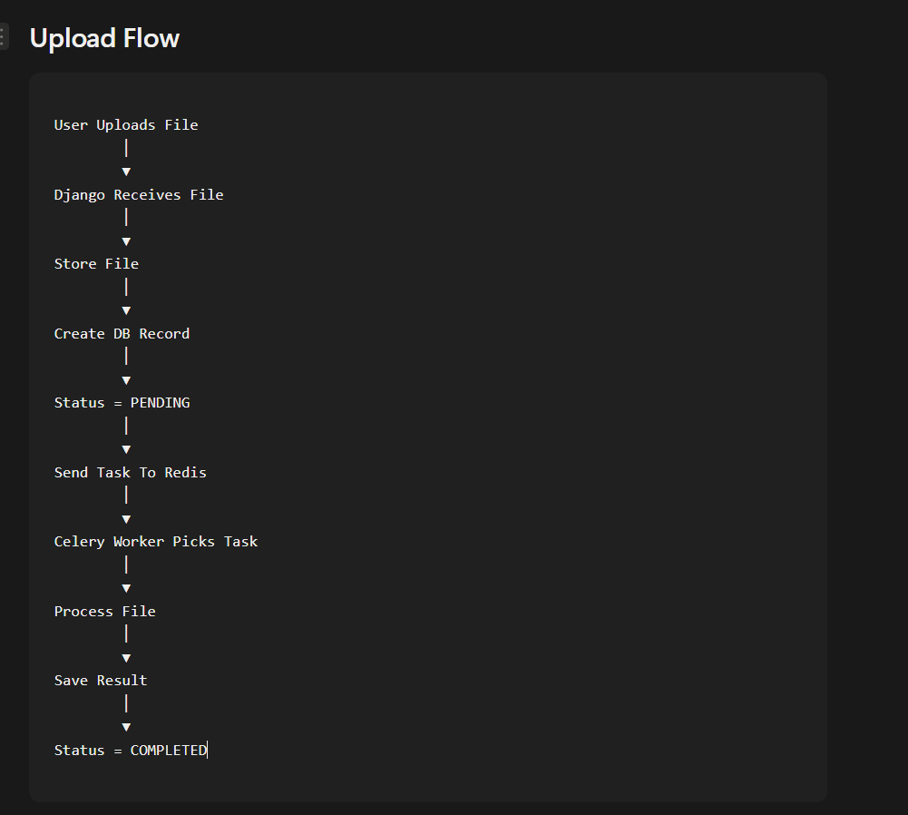
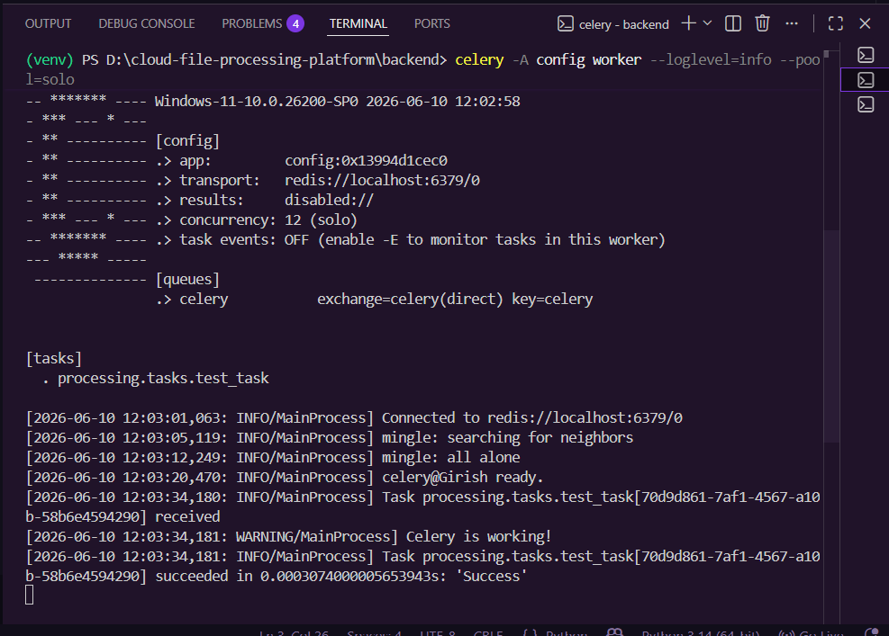
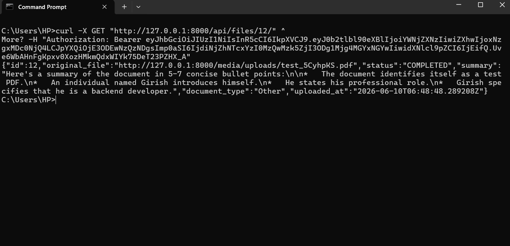

# Cloud File Processing Platform

An AI-powered document processing platform built with Django REST Framework, Celery, Redis, PostgreSQL, Docker, and Gemini AI.

The platform allows users to upload documents, process them asynchronously in the background, generate AI-powered summaries, classify document content, and retrieve structured results through secure REST APIs.

---

## Features

- JWT Authentication
- Secure File Uploads
- AI-Powered Document Summarization
- Document Classification
- Background Processing with Celery
- Redis Message Broker
- PostgreSQL Database
- Dockerized Deployment
- RESTful APIs
- Environment Variable Configuration

---

## Architecture Overview

The application follows an event-driven architecture where document processing happens asynchronously.

```text
User
 │
 ▼
Django REST API
 │
 ├── Stores File Metadata
 │
 ├── Uploads Document
 │
 ▼
Celery Task Queue
 │
 ▼
Redis Broker
 │
 ▼
Celery Worker
 │
 ├── Extract Document Text
 ├── Generate AI Summary
 ├── Classify Document Type
 │
 ▼
PostgreSQL Database
 │
 ▼
Processed Results API
```

---

## Technology Stack

### Backend

- Django
- Django REST Framework
- Simple JWT

### Background Processing

- Celery
- Redis

### Database

- PostgreSQL

### AI Processing

- Google Gemini API

### DevOps

- Docker
- Docker Compose

---

## Project Structure

```text
backend/
│
├── accounts/
│   ├── authentication
│   └── user management
│
├── uploads/
│   ├── file upload APIs
│   ├── serializers
│   ├── Gemini integration
│   └── result retrieval
│
├── processing/
│   └── Celery background tasks
│
├── config/
│   ├── settings
│   ├── urls
│   └── celery configuration
│
├── media/
│   └── uploaded files
│
├── Dockerfile
├── docker-compose.yml
└── requirements.txt
```

---

## Processing Workflow

1. User authenticates using JWT.
2. User uploads a document.
3. File metadata is stored in PostgreSQL.
4. Celery task is dispatched.
5. Redis queues the task.
6. Celery worker processes the document.
7. Gemini generates:
   - Document Summary
   - Document Classification
8. Results are stored in PostgreSQL.
9. User retrieves processed results through the API.

---

## Screenshots

### System Architecture



---

### Celery Background Processing



---

### Processed Document Output



---

## Example API Response

```json
{
  "id": 12,
  "status": "COMPLETED",
  "document_type": "Other",
  "summary": "Generated document summary...",
  "uploaded_at": "2026-06-10T06:48:48Z"
}
```

---

## Key Learning Outcomes

This project helped explore:

- Asynchronous task processing using Celery
- Message broker architecture with Redis
- AI integration using Gemini
- Docker containerization
- PostgreSQL database management
- JWT-based authentication
- Production-oriented backend architecture
- Event-driven processing workflows

---

## Future Improvements

- React Frontend Dashboard
- Real-Time Processing Status Updates
- WebSocket Notifications
- OCR Support for Images
- Multiple AI Model Support
- File Sharing and Collaboration
- Analytics Dashboard
- AWS Deployment Pipeline

---

## Author

**Girish Patil**

Backend Developer focused on building scalable systems, distributed workflows, and AI-powered applications.