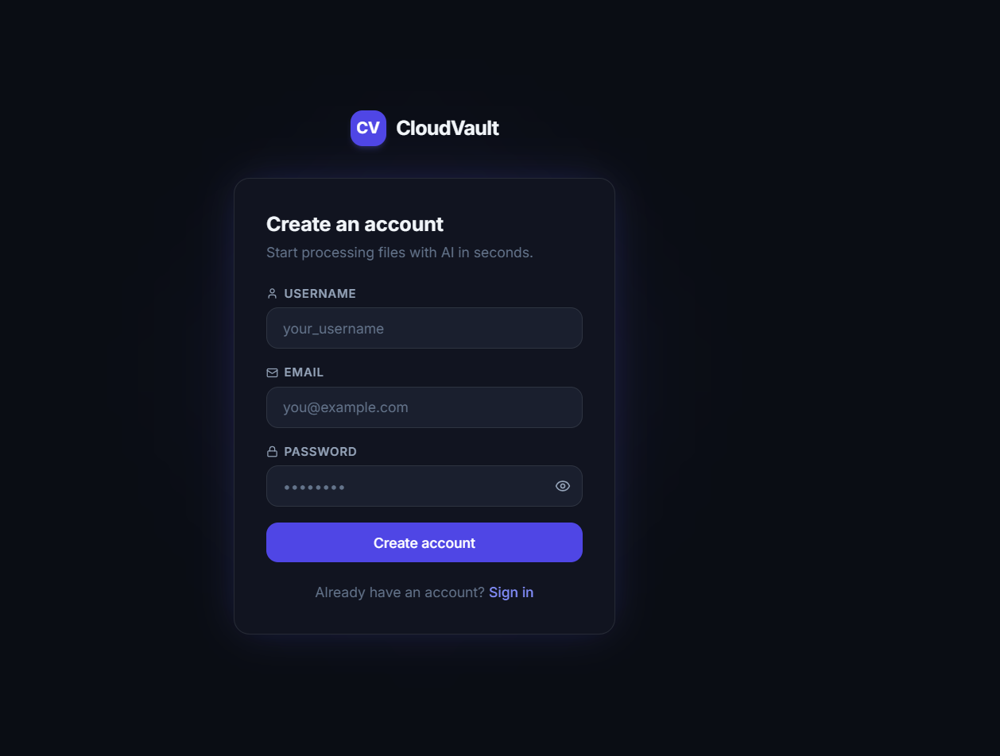
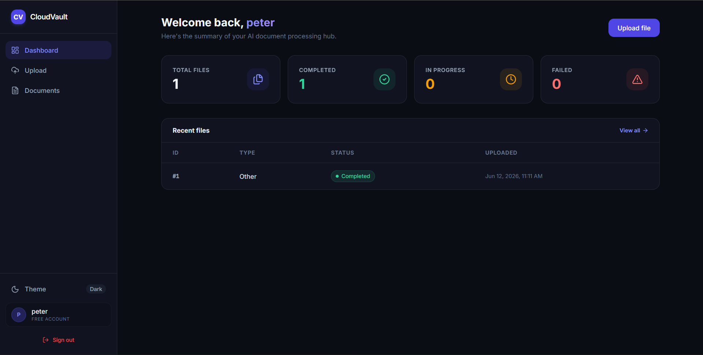
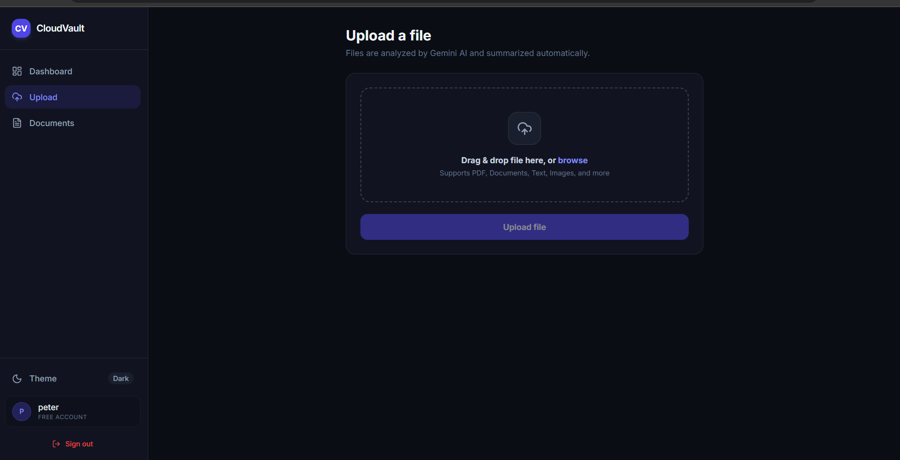
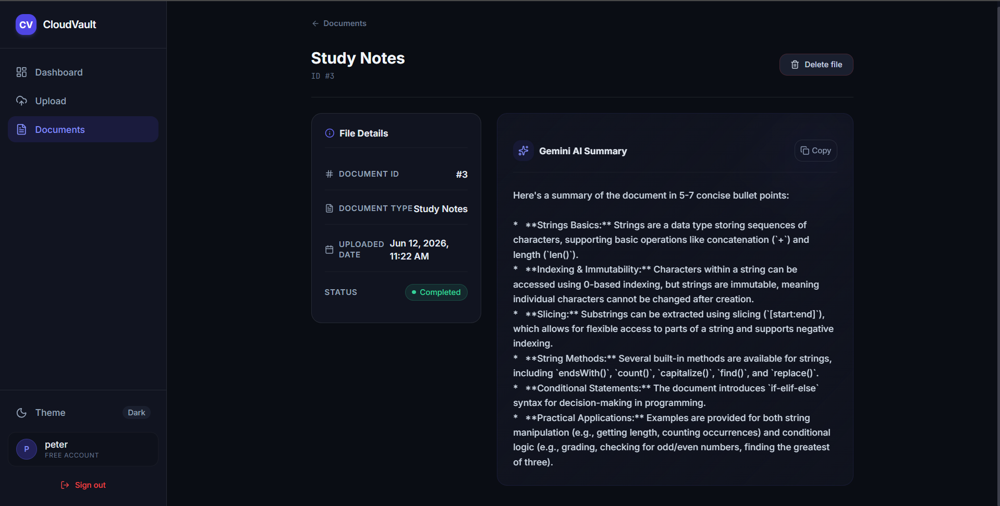

# 🚀 CloudVault – AI-Powered Document Processing Platform

CloudVault is a full-stack AI-powered document processing platform that allows users to upload PDF documents, automatically extract content, classify document types, and generate intelligent summaries using Google's Gemini AI.

The platform is built with a scalable asynchronous architecture using Django REST Framework, Celery, Redis, PostgreSQL, Docker, and React, demonstrating modern backend engineering, distributed task processing, authentication, and AI integration.

---

## 📌 Project Overview

Organizations process hundreds of documents daily. Manually reading, categorizing, and summarizing them is inefficient and time-consuming.

CloudVault automates this workflow by:

* Securely uploading PDF documents
* Extracting document content automatically
* Processing files asynchronously using Celery
* Generating AI-powered summaries using Gemini AI
* Classifying document types automatically
* Providing a centralized dashboard for document management

---

## 🏗️ System Architecture

### Processing Workflow

```text
User Uploads PDF
       │
       ▼
React Frontend
       │
       ▼
Django REST API
       │
       ▼
PostgreSQL Database
       │
       ▼
Celery Task Queue
       │
       ▼
Redis Broker
       │
       ▼
Gemini AI Processing
       │
       ▼
Summary + Classification
       │
       ▼
Dashboard Display
```

---

## 🛠️ Tech Stack

### Frontend

* React
* Vite
* React Router
* Axios
* Tailwind CSS

### Backend

* Django
* Django REST Framework
* JWT Authentication

### Database

* PostgreSQL

### Background Processing

* Celery
* Redis

### AI Integration

* Google Gemini API

### DevOps

* Docker
* Docker Compose

---

## ✨ Features

### 🔐 Authentication

* User Registration
* Secure Login
* JWT Authentication
* Protected Routes

### 📂 File Management

* Upload PDF Documents
* Store User-Specific Files
* View Uploaded Documents
* Delete Documents

### 🤖 AI Processing

* PDF Text Extraction
* Automatic Document Classification
* AI Summary Generation
* Background Processing using Celery

### 📊 Dashboard

* User-specific document management
* Upload tracking
* Processing status updates
* Document detail view

---

# 📸 Application Screenshots

## Login Page



---

## Dashboard



---

## Upload Document



---

## Document Details & AI Summary



---

## Project Architecture


---

## ⚡ Asynchronous Processing with Celery

CloudVault uses Celery workers and Redis to process uploaded documents asynchronously.

Benefits:

* Non-blocking uploads
* Better scalability
* Faster user experience
* Background AI processing
* Distributed task execution

### Celery Processing


---

## 🔒 Security Features

* JWT Authentication
* User-specific document isolation
* Protected API endpoints
* Environment-based configuration
* Secret key management
* Dockerized deployment architecture

---

## 📂 Project Structure

```text
cloud-file-processing-platform/
│
├── backend/
│   ├── accounts/
│   ├── uploads/
│   ├── processing/
│   ├── config/
│   ├── Dockerfile
│   ├── docker-compose.yml
│   └── requirements.txt
│
├── cloudvault/
│   ├── src/
│   ├── components/
│   ├── pages/
│   ├── services/
│   ├── api/
│   └── package.json
│
├── screenshots/
│
└── README.md
```

---

## 🚀 Local Setup

### Clone Repository

```bash
git clone https://github.com/girishpatil935/cloud-file-processing-platform.git

cd cloud-file-processing-platform
```

---

## Backend Setup

```bash
cd backend

python -m venv venv

venv\Scripts\activate

pip install -r requirements.txt
```

Create a `.env` file:

```env
SECRET_KEY=your_secret_key

DEBUG=True

DB_NAME=file_processing_db
DB_USER=postgres
DB_PASSWORD=password
DB_HOST=db
DB_PORT=5432

GEMINI_API_KEY=your_gemini_api_key
```

Start services:

```bash
docker compose up --build
```

Run migrations:

```bash
docker compose exec web python manage.py migrate
```

---

## Frontend Setup

```bash
cd cloudvault

npm install

npm run dev
```

Frontend:

```text
http://localhost:5173
```

Backend:

```text
http://localhost:8000
```

---

## 🎯 Skills Demonstrated

This project demonstrates hands-on experience with:

### Backend Engineering

* Django REST Framework
* REST API Design
* JWT Authentication
* Database Modeling

### Distributed Systems

* Celery Task Queues
* Redis Message Broker
* Asynchronous Processing

### Database Management

* PostgreSQL
* Data Persistence
* Query Optimization Concepts

### DevOps

* Docker
* Docker Compose
* Environment Configuration

### AI Integration

* Google Gemini API
* Prompt Engineering
* Automated Content Analysis

### Frontend Development

* React
* API Integration
* State Management
* Responsive UI Design

---

## 🔮 Future Improvements

* Dark / Light Theme Customization
* OCR Support for Images
* Multiple AI Model Support
* Real-Time Notifications
* WebSocket Integration
* File Sharing & Collaboration
* Analytics Dashboard
* AWS Deployment Pipeline
* Subscription-Based SaaS Features

---

## 👨‍💻 Author

### Girish Patil

Backend Developer focused on building scalable systems, distributed workflows, and AI-powered applications.

### Areas of Interest

* Backend Engineering
* System Design
* Distributed Systems
* Artificial Intelligence
* Cloud Technologies
* Software Architecture

---

## ⭐ Support

If you found this project interesting, consider giving it a star.

It helps others discover the project and supports continued development.
